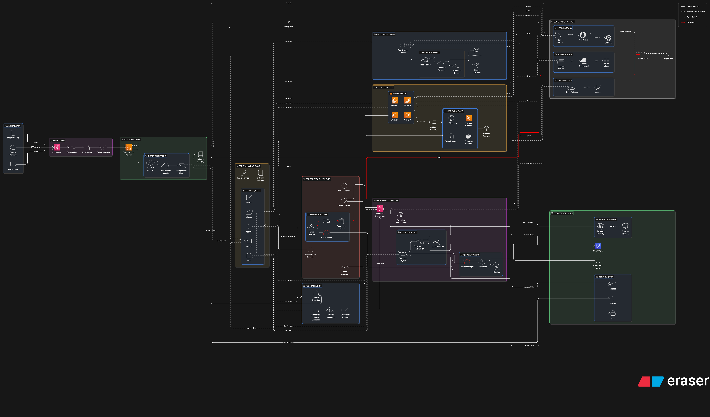

# System Architecture — EventMesh

EventMesh is a distributed event-processing platform built on a multi-stage pipeline. It decouples event ingestion, rule matching, and workflow orchestration into independent, asynchronous microservices connected via a streaming backbone.

## Design Reasoning

### 1. Unified Event Streaming Backbone

We chose **Kafka (Redpanda)** as the source of truth for all inter-service communication. Unlike traditional RPC or direct DB-based messaging, Kafka provides durable persistence and at-least-once delivery guarantees. This allows any service to be offline for maintenance without losing events.

### 2. Service Autonomy

Each of the 5 services (Auth, Ingestor, Rule-Engine, Orchestrator, Worker) is a standalone Go binary. They share no runtime memory and interact only through topics, ensuring that failure in the Rule Engine doesn't stop the Ingestor from accepting new events.

### 3. Shared State via Postgres/Redis

While services are stateless, we centralize durable workflow state in **PostgreSQL** (for reliability) and transient coordination state (locks/leases/idempotency) in **Redis** (for performance).

## Tradeoffs

| Choice | Benefit | Drawback |
|--------|---------|----------|
| **Asynchronous Architecture** | High throughput, fault tolerance | Increased complexity in tracing and debugging |
| **Separated Auth Service** | Centralized security, reusable across services | Adds an HTTP hop to the ingestion path |
| **Topic-per-service** | Clear observability, isolated failures | Requires more Redpanda partitions/resources |

## Failure Cases & Handling

- **Service Crash**: Services are stateless. On restart, they resume consuming from the last committed Kafka offset.
- **Dependency Lag**: If Redis is slow, the Ingestor returns 500 but data already in Kafka remains safe.
- **Broker Downtime**: Redpanda restart is handled via client-side reconnection logic. No events are lost as long as they were ACK'd by the broker.
