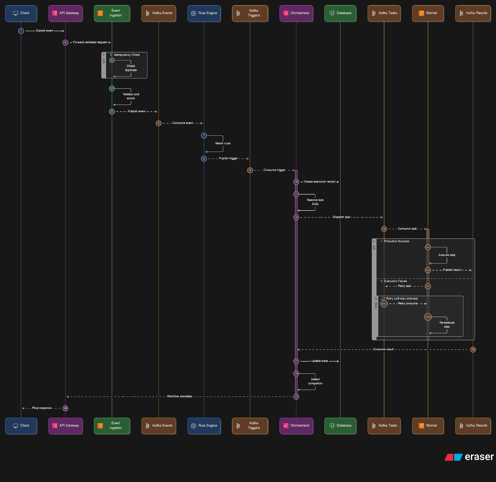

# Execution Flow — Event Lifecycle

The life of an event in EventMesh follows a strictly defined path to ensure reliability, visibility, and exactly-once processing.

## Design Reasoning

### 1. Synchronous vs Asynchronous ACK

The Ingestor waits for a successful Kafka ACK before responding to the client. This ensures that the system never acknowledges an event it hasn't durably stored. Subsequent processing (Matching, Orchestration, Worker execution) is entirely asynchronous.

### 2. Dual-Layer Idempotency Guardrails

We prevent duplicate execution at both the **entry point** (Ingestor) and the **execution point** (Worker). This multi-layered defense handles both network retries from the client and Kafka re-delivery storms internally.

### 3. Context Propagation

Every step of the flow carries a `correlation_id` and `request_id`. This allows for a continuous trace across HTTP boundaries and Kafka topics, making the complex 19-step flow observable.

## Tradeoffs

| Choice | Benefit | Drawback |
|--------|---------|----------|
| **Ingest-first Architecture** | Instant client response, high uptake capacity | Downstream services must handle potentially high-volume bursts |
| **Lease-based Dispatch** | Guaranteed worker ownership | Small delay (30s) if a worker crashes before reassignment |
| **JSON Serialization** | Readable log events, easy to debug | Slightly larger message size than Protobuf/Avro |

## Failure Cases & Handling

- **Ingestor Overload**: The ingestor is horizontally scalable. Adding instances behind a load balancer scales throughput.
- **Worker Timeout**: If a worker takes too long or crashes, its Redis lease expires. The orchestrator's stuck checker detects the `RUNNING` state without progress and reports it.
- **Rules Misconfiguration**: If an event type matches no rules, it is logged and dropped safely. No resources are wasted on unrouted events.
