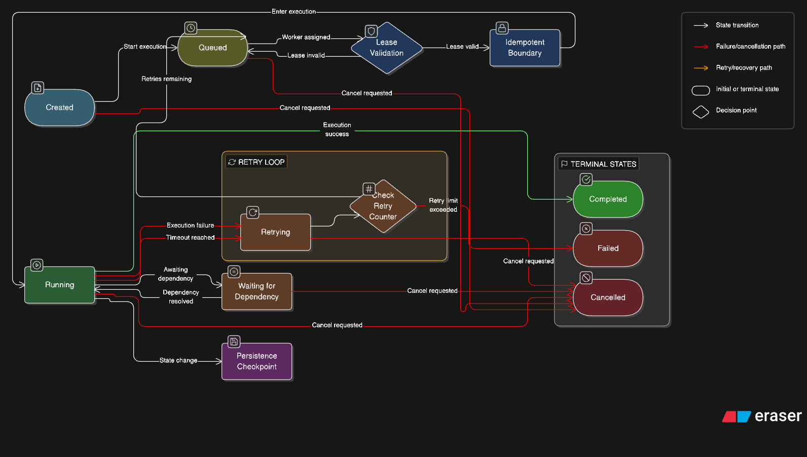

# Reliability & Fault Tolerance — EventMesh

EventMesh is designed with a "Failure as First Class Citizen" philosophy. The system assumes services will crash, brokers will restart, and workers will timeout.

## Design Reasoning

### 1. Transactional State Machine

The core of EventMesh reliability is the **Transactional State Machine**. Every workflow state transition (e.g., `PENDING` to `RUNNING`) is wrapped in a SQL transaction. This ensures that the orchestrator never advances its state without confirming the change is durably persisted in PostgreSQL.

### 2. Lease-Based Worker Coordination

Workers do not "check out" tasks permanently. Instead, they acquire a **30-second lease** in Redis. If the worker crashes, the lease naturally expires, allowing the system to detect and potentially reassign the task. This prevents "zombie" tasks from staying in `RUNNING` status forever.

### 3. Max Retry Limits & Failure Stream

The system implements a strict **3-retry limit** for failed tasks. After exhausting retries, the workflow is marked as `FAILED`, and a structured event is published to the `system_failures` Kafka topic. This decouples the execution engine from alerting/dashboarding services.

## Tradeoffs

| Choice | Benefit | Drawback |
|--------|---------|----------|
| **Local Checkpoints** | Fast recovery from service crashes | Increased database write IOps |
| **Short Lease TTL** | Rapid failure detection | Requires constant heartbeat/maintenance from worker |
| **Fail-Fast Ingestion** | Prevents system cascade during load | Low tolerance for temporary infra blips |

## Failure Cases & Handling

- **Redis Lock Drift**: In rare network partitioning cases, two workers might think they have the lease. We minimize this using Redis atomic `SetNX` operations.
- **Postgres Connection Exhaustion**: Services use connection pooling (`sql.DB`) to manage database handles efficiently during high concurrency.
- **Workflow Stalling**: The **Stuck Checker** monitor runs every 30 seconds to identify executions that have been in `RUNNING` for over 5 minutes without completion, ensuring no workflow is lost to the "either" of distributed states.
