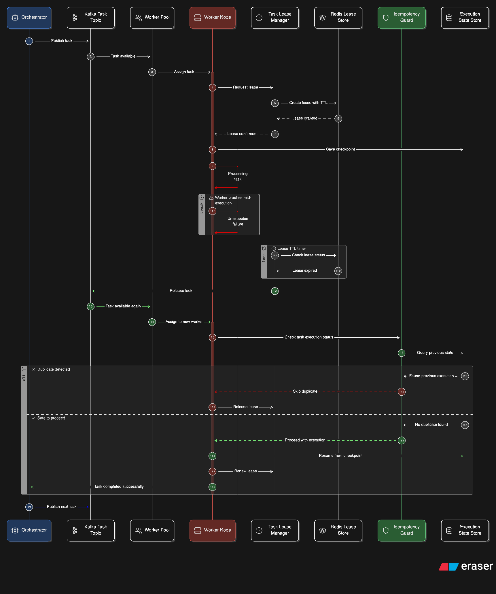

# Scaling and Concurrency — EventMesh

EventMesh is architected for horizontal scalability across all layers. The goal is to ensure that as event volume grows, the system can scale out by adding more instances of its microservices and partitions to its message bus.

## Design Reasoning

### 1. Partition-Based Parallelism

By leveraging **Kafka consumer groups**, scaling the processing layer (Rule Engine, Orchestrator, Workers) becomes as simple as increasing topic partitions and starting new service pods. Each pod independently processes its assigned partitions, ensuring linear scalability.

### 2. Stateless Service Logic

The core application logic in EventMesh is stateless. All shared state is externalized to Postgres and Redis. This allows for rapid horizontal scaling during traffic spikes without the need for session affinity or complex state synchronization between nodes.

### 3. Asynchronous Workflow Advancement

Workflows advance step-by-step via Kafka events. This decouples the speed of ingestion from the speed of execution. If workers are under-provisioned, the system naturally buffers tasks in Kafka (`workflow_tasks` topic) without impacting the Ingestor's ability to accept new events.

## Tradeoffs

| Choice | Benefit | Drawback |
|--------|---------|----------|
| **External Managed State** | Simplifies scaling of application nodes | Creates a database bottleneck at very high volumes |
| **Kafka Partitions** | Deterministic load balancing | Changing partition count requires rebalancing/downtime |
| **Lease Mechanism** | Prevents concurrent duplicate execution | Adds overhead to the worker's execution loop |

## Scaling Strategy

| Component | Scaling Lever | Target Metric |
|-----------|--------------|---------------|
| **Event Ingestor** | Horizontal instances | Ingestion latency, throughput |
| **Rule Engine** | Kafka partitions + instances | Consumer lag (events topic) |
| **Orchestrator** | Kafka partitions + instances | Consumer lag (triggers/results) |
| **Worker** | Horizontal instances | Consumer lag (tasks topic) |
| **Kafka Cluster** | Broker nodes + partitions | Disk IO, Network throughput |
| **Postgres** | Vertical scale / Read replicas | Connection count, Write IO |
| **Redis** | Redis Cluster (sharding) | Lock/Lease acquisition latency |
